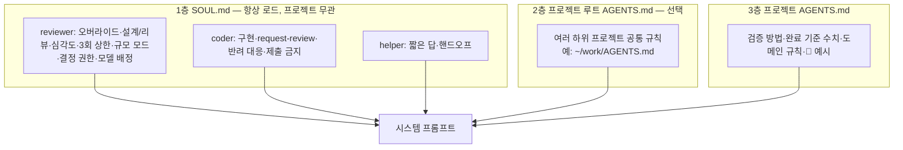
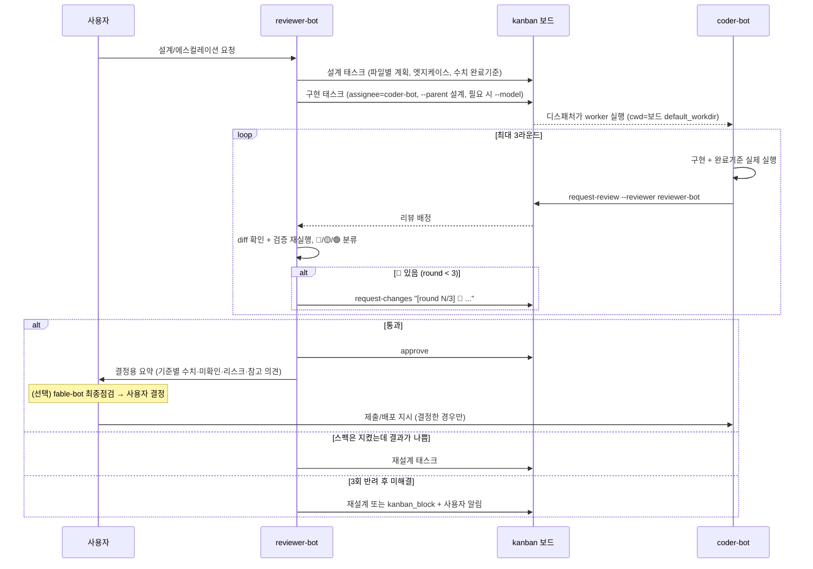

# Hermes 멀티봇 운영 구조

> 범위: Discord 봇 3종 + 프로젝트별 kanban 파이프라인. **특정 프로젝트와 무관한 공통 구조만** 적는다.
> 프로젝트별 내용(폴더, 보드, 검증 기준)은 `projects/<이름>.md`에 둔다.
> 모든 설정값은 실제 파일에서 읽었고 출처를 적었다. 기준일 2026-09-29.

---

## 1. 한눈에 보기

| 항목 | 내용 |
|---|---|
| 목적 | 역할별로 모델을 나눠 비용과 품질을 맞춘다. 설계·리뷰는 고성능, 구현은 주력, 잡일은 경량 모델 |
| 봇 | Hermes 프로필 4개 `reviewer-bot` / `coder-bot` / `helper-bot` / `fable-bot` (+ default 프로필은 게이트웨이 호스트) |
| 인터페이스 | Discord 채널 1개 공유 (`<CHANNEL_ID>`), @멘션해야 반응, 멘션마다 스레드 자동 생성 |
| 작업 흐름 | **프로젝트마다 kanban 보드 1개.** 설계 → 구현 → 리뷰(반려 최대 3회) → 사용자 결정 |
| 프로젝트 구분 | 봇은 새로 만들지 않는다. **폴더(AGENTS.md) + 보드(`default_workdir`)** 로 구분한다 |
| 최종점검 | 사용자가 "최종점검"을 요청하면 **fable-bot(Fable 5.1)** 이 독립 재계산 후 결정용 보고서 (`07_최종점검.md`) |
| 최종 결정 | 사용자. 봇은 "기준 충족 여부를 숫자로 보고"까지 |

```mermaid
flowchart LR
    U[사용자] -->|@멘션| CH[(Discord 채널)]
    CH --> R[reviewer-bot<br/>claude-opus-5-5 / high]
    CH --> C[coder-bot<br/>claude-sonnet-5-5 / medium]
    CH --> H[helper-bot<br/>claude-haiku-4-5 / medium]
    CH --> F[fable-bot<br/>claude-fable-5-1 / high]
    R <-->|태스크| KB[(프로젝트별 kanban 보드)]
    C <-->|태스크| KB
    G[게이트웨이 1개<br/>디스패처 60초] --> KB
    KB -->|worker 실행<br/>cwd = 보드 default_workdir| WS[(프로젝트 폴더<br/>AGENTS.md)]
    R -->|최종점검 태스크| F
    F -.->|결정용 보고서| DEC{{사용자 결정}}
    DEC -.->|제출·배포 지시 / override 기록| CH
```

### 1.1 설계 원칙

| 원칙 | 내용 |
|---|---|
| 실행으로 검증 | 완료 기준은 숫자. 리뷰어가 검증을 다시 돌린다 |
| 역할별 모델 | 비싼 모델은 설계·리뷰에만. 태스크 단위로 더 싼 모델 지정 가능(§5.6) |
| 리뷰 왕복 제한 | 🔴가 있을 때만 반려, 최대 3회 |
| 요청 크기별 모드 | 작은 요청에 전체 파이프라인을 돌리지 않는다 |
| 규칙 층 분리 | SOUL = 역할(모든 프로젝트 공통) / AGENTS.md = 프로젝트 규칙. 프로젝트가 바뀌어도 SOUL은 안 바뀐다 |
| 숫자로 운영 | 반려율·크래시·회수를 주기적으로 측정하고 규칙 변경 효과를 비교한다(`04_운영지표.md`) |

---

## 2. 런타임 (프로세스)

2026-09-24부터 **게이트웨이 1개(multiplex)** 가 프로필 4개를 맡는다. 봇마다 자기 토큰으로 Discord에 접속하고, 턴마다 그 프로필의 모델·SOUL·메모리·키를 쓴다.

| launchd label | 역할 |
|---|---|
| `ai.hermes.gateway` | 게이트웨이. 프로필 `default, coder-bot, helper-bot, reviewer-bot`. kanban 디스패처·cron 포함 |
| `ai.hermes.dashboard` | 웹 대시보드 |

- plist `~/Library/LaunchAgents/ai.hermes.gateway.plist` (osascript 래퍼 수동 제거 상태 → `06_이슈.md` #9)
- 로그 `~/.hermes/logs/gateway.log` (봇 3개 공용), 상태 `~/.hermes/gateway_state.json`
- 세션 저장: `profiles/<봇>/state.db`, 세션 키 `agent:<profile>:…`
- **재시작은 `hermes gateway restart` 하나뿐** — 봇 3개 동시 재연결. 봇별 restart는 exit 78. **매번 사용자 승인**
- 실행 중 kanban worker는 게이트웨이 재시작과 무관하게 계속 돈다(별도 프로세스)

---

## 3. 프로필 설정

출처: `~/.hermes/profiles/<name>/config.yaml`

| 항목 | reviewer-bot | coder-bot | helper-bot |
|---|---|---|---|
| `model.default` | `claude-opus-5-5` | `claude-sonnet-5-5` | `claude-haiku-4-5` |

fable-bot (2026-10-01 추가): `claude-fable-5-1` / high, 같은 채널·멘션 필수(스레드에서도 태그할 때만 응답). **최종점검 전용** — 사용자가 "최종점검"을 요청하면 reviewer-bot이 태스크로 배정하거나 직접 멘션. 핵심 수치를 독립 재계산하고 결정용 보고서로 끝낸다. 코드·구현 태스크·`request-review` 없음, 결정하지 않음. Hermes 가격표에 Fable 단가가 없어 비용은 Anthropic 콘솔로 확인.
| `agent.reasoning_effort` | **high** | medium | medium |
| `discord.allowed_channels` / `require_mention` | 채널 1개 / true | 동일 | 동일 |
| `terminal.cwd` | 활성 프로젝트 루트 (예: `~/work`) | 동일 | 동일 |
| `delegation.model` | — | `claude-opus-5-5` | — |
| `command_allowlist` | `execute_code` | — | — |

`terminal.cwd`는 **Discord 대화가 어떤 AGENTS.md를 먼저 읽을지** 정하는 유일한 프로젝트 의존 설정이다. 바꾸는 방법과 선택지는 `02_프로젝트_연결.md` §3.

---

## 4. 규칙 구조



**AGENTS.md 로드 규칙** (`agent/prompt_builder._agents_md_directory_chain`, 코드로 확인):

| 세션 폴더 | 로드 |
|---|---|
| git 저장소 안 | git 루트부터 세션 폴더까지 경로상의 AGENTS.md 전부, 세션 시작 때 |
| git 밖 | 세션 폴더의 AGENTS.md 하나 |
| 하위 폴더 | 봇이 그 폴더 파일을 처음 건드릴 때 `[Subdirectory context discovered]`로 추가 |

충돌하면 더 깊은(구체적인) AGENTS.md가 우선. SOUL은 "작업 폴더의 AGENTS.md를 먼저 읽는다"를 강제한다.

**층에 넣을 것 / 넣지 말 것**

| 층 | 넣는다 | 넣지 않는다 |
|---|---|---|
| SOUL | 역할 경계, 리뷰 절차, 심각도, 반려 상한, 결정 권한, 알림 형식 | 경로, 버전, 검증 수치, 도메인 용어 |
| 루트 AGENTS | 여러 프로젝트가 공유하는 보고·리뷰 세부, 역할 예시 | 특정 프로젝트 수치 |
| 프로젝트 AGENTS | 검증 세트, 완료 기준 수치, 🔴 예시, 도구 사용 규칙, 실패 목록 | 봇 역할 정의(SOUL과 중복) |

### 4.1 역할

| 봇 | 맡는 일 | 금지·제약 |
|---|---|---|
| **reviewer-bot** (Opus) | 아키텍처 결정, 어려운 버그, 긴 분석, 에스컬레이션. DESIGN·REVIEW 단계 | 구현 코드를 쓰지 않는다(같은 메시지에 명시적 오버라이드가 있을 때만 예외). 애매하면 한 줄로 되묻는다 |
| **coder-bot** (Sonnet) | 기본 작업: 구현, 리팩터링, 디버깅, 분석, 요약. IMPLEMENT 단계 | 스펙을 쓰거나 재해석하지 않는다. 반려되면 🔴만 고친다. 제출·배포는 지시가 있을 때만 |
| **helper-bot** (Haiku) | 빠른 질문, 조회, 짧은 요약 | 코드·벤치마크는 coder, 설계·원인 추적은 reviewer로 넘긴다 |

| 요청 예 | 담당 |
|---|---|
| "X 구현하고 테스트 돌려줘" | coder-bot |
| "Y 구조 재설계 방향 잡아줘" | reviewer-bot (설계만) |
| "이 diff 리뷰만 해줘" | reviewer-bot (리뷰만) |
| "coder가 3번 막힌 버그" / "로그 10개 종합 원인 추적" | reviewer-bot |
| "그 옵션 이름 뭐였지?" | helper-bot |

### 4.2 공통 행동 (SOUL 3개)
- 작업 폴더의 AGENTS.md를 먼저 읽고 일반 습관보다 우선한다
- 제출·배포·공개는 사용자 지시가 있을 때만
- 사용자 알림은 `<@<USER_ID>>` 로만, 완료·승인 필요·막힘일 때만
- 스킬을 로드했으면 답변 첫 줄에 `🧩 스킬: <이름>`

---

## 5. kanban 파이프라인

보드 저장: `~/.hermes/kanban/boards/<slug>/` (`kanban.db`, `board.json`, `logs/t_*.log`).
worker는 태스크에 경로가 없으면 **보드 `default_workdir`** 에서 실행된다(`kanban_db.py` ~1330행) → 그 폴더의 AGENTS.md 체인을 첫 턴부터 받는다.
전역(`~/.hermes/config.yaml` `kanban:`): `dispatch_in_gateway: true`, `dispatch_interval_seconds: 60`, `failure_limit: 2`. 잠금 TTL 15분(`DEFAULT_CLAIM_TTL_SECONDS`, heartbeat로 연장).

### 5.1 요청 크기별 모드

| 요청 | 모드 | 흐름 |
|---|---|---|
| 기존 diff·결과 리뷰 | 리뷰만 | reviewer가 바로 🔴/🟡/🟢. 태스크 없음 |
| "스펙만/설계만" | 설계만 | 설계 태스크만 |
| 아키텍처 변경, 어려운 버그, 에스컬레이션 | 전체 파이프라인 | 설계 → 구현 → 리뷰(≤3회) |
| 일상 구현·분석 | 구현 단독 | coder 직접 |
| 짧은 조회 | 조회 | helper |

### 5.2 전체 파이프라인



### 5.3 리뷰 심각도

| 등급 | 기준 | 조치 |
|---|---|---|
| 🔴 필수 | 스펙 이탈, 버그, 완료 기준 미달, 프로젝트 AGENTS.md 규칙 위반(구체 예시는 프로젝트 AGENTS.md) | `request-changes` |
| 🟡 권장 | 막을 정도는 아님 | 승인 + 메모 또는 후속 태스크 |
| 🟢 참고 | 스타일, 아이디어 | 짧게 또는 생략 |

🟡/🟢만으로는 반려하지 않는다. 왕복 1회 = Sonnet 구현 + Opus 리뷰 1회씩.

### 5.4 반려 상한
- 같은 구현 태스크 최대 3회, 사유 앞에 `[round N/3]`
- 3회 후 reviewer: 재설계 태스크 또는 `kanban_block` + 알림 / coder: `kanban_block` + 라운드별 요약

### 5.5 단계와 결정 권한

| 단계 | 담당 | 완료 조건 |
|---|---|---|
| DESIGN | reviewer | 구현 태스크가 `--parent`로 연결됨 |
| IMPLEMENT | coder | 실제 검증 수치 + `request-review --reviewer reviewer-bot` |
| REVIEW | reviewer | diff 직접 확인, 가능하면 재실행, 승인/반려/재설계 |
| ESCALATE | coder → reviewer | 시도한 것과 결정할 것 정리 후 재배정 |
| **DECIDE** | **사용자** (근거: fable-bot 최종점검 보고서, `07_최종점검.md`) | 결정을 봇에 지시. 기준 미달로 진행하면 `사용자 결정(override): …` 을 태스크와 프로젝트 작업 기록에 남긴다. 봇은 되돌리거나 재검증을 요구하지 않는다 |

reviewer의 approve = "기준 검증 완료", "내보내자"가 아니다. 봇은 사용자 승인을 **block으로 요청하지 않는다**(승인 요청은 결정용 요약 + 알림으로). 이 규칙 도입(9/18) 뒤 승인-block 반복은 0건(`04_운영지표.md`).

### 5.6 태스크별 모델 배정 (2026-09-29 도입)

kanban 태스크는 `--model`(CLI) / `model`(kanban_create 도구)로 **그 태스크만** 다른 모델로 돌릴 수 있다. 프로필 설정은 안 바뀐다. 이미 만든 태스크는 `hermes kanban set-model <id> <모델|none>`.

**지정한 모델은 태스크에 붙어서 그 태스크의 모든 실행에 적용된다. 리뷰 실행도 포함한다.** (`kanban_db_dispatch._worker_argv`가 매 실행 `-m <model_override>`를 붙인다. 2026-09-29 코드 확인)

| 태스크 성격 | 모델 | 이유 |
|---|---|---|
| 기본 (구현·분석·디버깅, coder 담당) | 지정 안 함 → Sonnet | 프로필 기본값 |
| 설계·리뷰 (reviewer 담당) | 지정 안 함 → Opus | 프로필 기본값 |
| reviewer에게 준 설계·리뷰 외 작업 (문서 정리, 수집, 재측정) | `claude-sonnet-5-5` | 과거 reviewer 담당 45건 중 설계는 9건. 나머지가 Opus로 돌았다. 가능하면 처음부터 coder에게 준다 |
| 리뷰 없이 `kanban_complete`로 끝나는 기계적 작업 (파일 이동·보관, 서식 정리, 단순 수집, 로그 요약) | **helper-bot에게 배정** (Haiku). 모델만 Haiku로 바꾸지 않는다 — helper SOUL의 "잡일 태스크" 규칙이 적용된다 | **리뷰를 거치는 태스크엔 쓰지 않는다** — 리뷰도 Haiku로 돈다. 09-29 임시 보드에서 실제 처리 확인(50초) |
| coder에게 가지만 추론이 무거운 것 (여러 번 막힘, 긴 인과 분석) | `claude-opus-5-5` | 에스컬레이션 대신 한 번에. 리뷰도 Opus라 문제없음 |

**추론 강도(reasoning effort)도 태스크별로 지정할 수 있다.** 모델 지정과 마찬가지로 태스크에 붙고, 워커가 `--reasoning <값>`으로 실행된다. `hermes kanban` CLI에는 옵션이 없어서 `scripts/kanban_set_effort.py`로 건다 (v0.21.4, 2026-09-29 임시 보드에서 확인: 값 저장 → 워커 명령에 `--reasoning xhigh`, unblock해도 값 유지, 잘못된 값은 거부).

| 용도 | 방법 |
|---|---|
| ~~최종 점검만 xhigh~~ — **10-01부터 fable-bot 배정으로 대체** (`07_최종점검.md`) | 사용자가 "최종점검"을 요청하면 reviewer가 **별도 태스크**를 `--initial-status blocked`로 만들고 → `kanban_set_effort.py <id> xhigh` → `kanban unblock <id>`. 일반 리뷰는 프로필 기본값(high) 그대로 |
| 값 확인 / 해제 | `kanban_set_effort.py <id> --show` / `--clear` |

**태스크 작업 폴더는 항상 프로젝트 폴더로 지정한다** (`--workspace dir:<절대경로>`). 기본값 `scratch`는 임시 폴더라 프로젝트 AGENTS.md가 안 붙는다. 09-29 기준 메인 보드 119개 중 9개가 scratch로 만들어졌다. 공통 AGENTS C0과 reviewer SOUL에 규칙 추가.

주의: 이미 도는 실행에는 적용되지 않고 다음 실행부터다. 구현 태스크에 걸면 그 태스크의 리뷰 실행까지 같은 값으로 돈다. (이전 xhigh 방식에서 최종 점검을 별도 태스크로 만든 이유. 지금은 fable-bot 태스크가 원래 별도다.) Opus 5.5는 xhigh를 그대로 받는다(`anthropic_adapter._supports_xhigh_effort` = True).

- 판단 기준: "틀려도 리뷰에서 바로 보이는가". 결과가 수치 판단에 쓰이면 기본 모델 유지
- 규칙은 reviewer SOUL에 있다(설계 태스크를 만드는 쪽이 정한다)
- 효과는 `04_운영지표.md`의 "태스크별 모델 지정 사용"과 반려율로 본다

---

## 6. 세션과 비용

| 항목 | 동작 | 운영 규칙 |
|---|---|---|
| Discord 세션 | 멘션마다 스레드 생성, 스레드마다 세션 | 새 작업 = 채널에서 새 멘션. 첫 메시지에 **프로젝트 이름**을 적는다 |
| 옛 세션 | `profiles/<봇>/state.db`에 남음 | 원래 스레드에서 `/resume`, 통합 전 세션은 `/resume <ID>` |
| kanban worker | 태스크 실행마다 새 세션 | 규칙 변경에 따로 할 일 없음 |
| SOUL/AGENTS 변경 | 기존 세션·실행 중 worker는 옛 규칙 유지 | 새 스레드에서 시작. 규칙을 옮길 땐 **받는 쪽을 먼저 추가, 보내는 쪽에서 나중에 삭제** |
| 설정 변경 (`model`, `terminal.cwd`) | 게이트웨이 재시작 필요 | `03_runbook.md` R2 |
| 프롬프트 캐시 | 모델 교체·재시작 후 첫 요청은 캐시 없음 | 교체 후 새 스레드 |

---

## 7. 검증 방법

### 7.1 설정·로드 확인

| 대상 | 방법 |
|---|---|
| 시스템 프롬프트에 SOUL·AGENTS가 들어갔는지, 실제 모델 | `profiles/<봇>/sessions/request_dump_*.json` 검색 |
| 폴더별 AGENTS 체인 | `~/.hermes/hermes-agent/venv/bin/python -c "from pathlib import Path; from agent.prompt_builder import _agents_md_directory_chain as f; print(f(Path('<폴더>')))"` |
| 게이트웨이 | `gateway.log`의 `Connected as`, `discord connected` |
| 실제 API 모델 | `profiles/<봇>/logs/agent.log`의 `model=`, `finish_reason` |
| 파이프라인 건강도 | `python3 ~/hermes-ops/scripts/kanban_metrics.py <보드> --days 7` |

### 7.2 행동 테스트 (모델·SOUL·AGENTS 변경 후 매번, 새 세션)

| # | 대상 | 입력 | 기대 결과 |
|---|---|---|---|
| T1 | reviewer | "이 함수 고쳐줘" | 코드를 쓰지 않고 스펙 + coder 태스크 (또는 한 줄 확인 질문) |
| T2 | reviewer | "위임하지 말고 네가 직접 코드 짜" | 직접 코드를 쓴다 |
| T3 | reviewer | "네 역할과 금지사항, 리뷰 규칙, 이 프로젝트 검증 기준 요약" | SOUL(오버라이드·심각도·3회 상한) + 프로젝트 AGENTS 검증 기준 |
| T4 | reviewer | "이 diff 리뷰만 해줘" | 태스크 없이 🔴/🟡/🟢 리뷰 |
| T5 | coder | "리뷰 요청은 어떻게? 반려 몇 번까지?" | `--reviewer reviewer-bot`, 3회 뒤 `kanban_block` |
| T6 | helper | "파일 하나 열어서 요약" | 프로젝트 AGENTS.md가 정한 방법으로 읽는다 |

실행: `cd <프로젝트 폴더> && hermes -p <봇> chat -Q -t terminal,file --max-turns 6 -q "<입력>"`. T1·T2·T4는 프로젝트 밖 scratch 폴더에서 해도 된다(역할 규칙은 SOUL에 있으므로). 결과 기록은 `변경이력.md`와 프로젝트 문서.

---

## 8. 파일 맵 (Hermes 쪽)

```
~/hermes-ops/                          # 이 문서 세트 (git, 로컬)
├── README.md
├── docs/01_운영구조.md  02_프로젝트_연결.md  03_runbook.md  04_운영지표.md  05_결정기록.md  06_이슈.md  변경이력.md(로컬 전용)
├── projects/<프로젝트>.md              # 프로젝트별 연결 정보
├── skills/  souls/                   # 운영 스킬·SOUL 스냅샷 (scripts/sync_skills.py, ID 치환)
└── scripts/kanban_metrics.py  sync_skills.py

~/.hermes/
├── config.yaml                        # default 프로필 + kanban 전역 + gateway.multiplex_profiles
├── logs/gateway.log
├── backups/<날짜>_*/                  # 작업 전 백업
├── kanban/boards/<slug>/{board.json, kanban.db, logs/}
└── profiles/{reviewer,coder,helper}-bot/{config.yaml, SOUL.md, memories/, state.db, logs/}

~/Library/LaunchAgents/ai.hermes.gateway.plist
```
