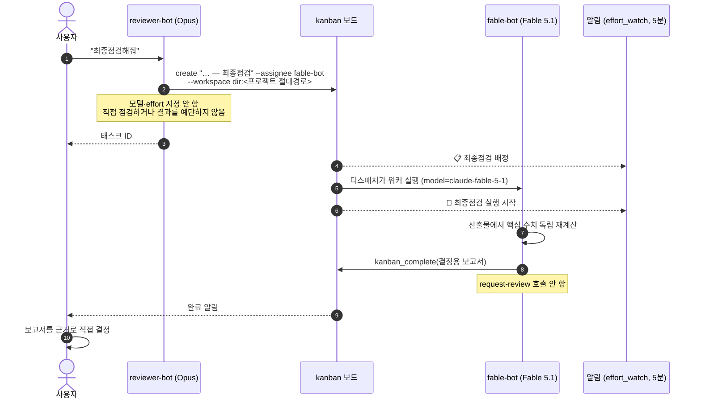

# 07. 최종점검 — fable-bot

제출·배포처럼 되돌리기 어려운 결정 직전에 하는 **최종점검**은 4번째 봇 `fable-bot`(Claude Fable 5.1)이 맡는다. 2026-10-01부터 적용됐고, 이전 방식(reviewer의 Opus를 그 태스크만 `xhigh`로 돌리기)을 대체했다. 결정 이유는 `05_결정기록.md` D11에 있다.

## 1. 왜 effort(xhigh)가 아니라 다른 모델인가

| | 이전: Opus 5.5 + xhigh | 현재: fable-bot (Fable 5.1) |
|---|---|---|
| 점검하는 쪽 | 설계·리뷰를 한 **같은 모델**이 더 오래 생각 | 설계·리뷰와 **다른 모델**이 처음부터 다시 계산 |
| 맹점 | 설계자와 같은 가정을 공유할 수 있음 | 교차 검증 |
| 절차 | blocked로 생성 → `kanban_set_effort.py xhigh` → unblock (순서를 틀리면 effort 없이 실행됨) | 태스크를 fable-bot에게 배정하면 끝. 모델·effort 지정 없음 |
| Discord | 직접 부를 수 없음 | `@fable-bot` 멘션으로 직접 요청 가능 |
| 비용 | 출력 토큰만 증가, 단가 알려짐 | **Hermes 가격표에 Fable 단가 없음** → 사용량 보고에 집계 안 됨. Anthropic 콘솔로 확인 |

## 2. 흐름

직접 경로: Discord 아무 스레드에서 `@fable-bot`을 태그해 요청할 수도 있다.

| 경로 | fable이 받는 것 | 언제 |
|---|---|---|
| **기본: reviewer에게 "최종점검해줘"** | reviewer가 쓴 태스크 본문(결정 대상, 산출물 경로, 통과 기준, 확인한 것)만. 대화 기록 없음 → 토큰 최소, 보드에 기록 남음 | 평소 |
| 직접 태그 | 그 스레드의 최근 Discord 메시지(최대 50개, 다른 봇 메시지 포함). reviewer 세션의 도구 호출·파일 내용은 넘어가지 않음 | 급할 때, 열린 옛 스레드에서 |

요약에는 결론 대신 **경로와 기준**을 준다. reviewer가 놓친 건 요약에서도 빠지므로, fable은 산출물에서 직접 확인한다.

### 2.1 누가 검증하는지 스레드에 표시 (10-01 추가)

| 요청 | reviewer 응답 첫 줄 |
|---|---|
| "최종점검해줘" | `🔀 최종점검 → fable-bot (Claude Fable 5.1) · <task_id> · 결과는 이 스레드로 옵니다` |
| "자세히 검증해줘", "검증하고 진행해줘" 등 | `🔍 reviewer(Opus) 직접 검증 — 최종점검 아님 (fable 필요하면 "최종점검"이라고 요청)` |

**fable로 가는 건 "최종점검"이라는 단어뿐이다** (선택 A). 일상 검증까지 Fable로 돌리면 비용이 커진다. 대신 🔍 표시로 지금 어떤 모델이 검증하는지 항상 보이게 했다.
배경: "자세히 검증해주고 진행해줘"를 fable 요청으로 기대했는데 reviewer가 직접 처리했고, 스레드에서는 구분이 안 됐다.
fable 태스크가 끝나면 `[kanban] Task … completed` 알림이 태스크를 만든 스레드로 돌아온다. 📋 배정·🧠 실행 알림은 채널 본문에 뜬다.
검증: 새 세션 두 개에 "최종점검해줘" → 🔀 줄과 fable-bot 태스크 생성, "자세히 검증해줘" → 🔍 줄과 직접 검증·태스크 0건.

## 3. 역할 경계

| 봇 | 최종점검에서 하는 일 | 하지 않는 일 |
|---|---|---|
| reviewer-bot | 태스크 본문 작성(어떤 결정을 위한 점검인지, 산출물 경로, 프로젝트 AGENTS의 통과 기준, 이미 확인한 것) → fable-bot에게 배정 | 대화 안에서 직접 최종점검, 결과 예단, effort/모델 고정 |
| fable-bot | 기준별 수치 재계산, 결함 보고, 결정용 보고서 | 코드 작성·수정, 구현 태스크 생성, `request-review`, **결정** |
| 사용자 | 결정 (제출·배포·검증 종료) | — |

"fable-bot 통과"는 **제출 승인이 아니다.** 보고서는 결정 근거다.

## 4. 결정용 보고서 형식 (fable-bot SOUL)

1. 기준별 판정: 충족 / 미달 / 미확인 — 수치와 그 수치를 얻은 방법
2. 결함: 심각도순 (🔴 결정을 막음, 🟡 고쳐야 함, 🟢 참고), 재현 경로 포함
3. 확인하지 못한 것과 이유
4. 그대로 진행할 때의 리스크
5. (선택) 추천 — "참고 의견"으로 명시

## 5. 설정

| 항목 | 값 |
|---|---|
| 프로필 | `fable-bot` (reviewer-bot 복제, 채널 정보는 복제하지 않음 — `--clone-from reviewer-bot`, `--clone-channels` 없음) |
| 모델 / effort | `claude-fable-5-1` / high |
| Discord | 같은 채널, `require_mention: true`, 허용 사용자 = 운영자 1명, 명령 동기화 off |
| 토큰 | 프로필 `.env`에 `DISCORD_BOT_TOKEN` **1줄**. 멀티플렉스 게이트웨이가 `.env` 변경을 감지해 재시작 없이 연결 |
| 메모리 | 복제된 reviewer 전용 항목 제거, 역할 중립 항목만 유지 |
| 규칙 위치 | fable-bot SOUL(역할·보고서), reviewer SOUL(배정 절차), 프로젝트 공통 AGENTS C5(역할)·C7(결정 권한) |
| 스레드 동작 | `thread_require_mention: true` (fable은 태그할 때만 응답 — 다른 봇 스레드에 한 번 불러도 이후 메시지마다 끼어들지 않음), `allow_bots: mentions` (태그 시 스레드의 다른 봇 메시지도 맥락으로 읽음, 최근 50개까지) |
| 알림 | `effort_watch.py`가 fable-bot 태스크의 `created/assigned/reassigned` → 📋, `spawned` → 🧠 |

## 6. 검증 (2026-10-01)

임시 보드 두 번, 끝난 뒤 보드는 보관 처리.

| 테스트 | 방법 | 결과 |
|---|---|---|
| 직접 배정 | fable-bot에게 태스크를 직접 배정. 주장 2개 모두 참인 데이터 | 88초 done, 워커 `model=claude-fable-5-1`, 두 기준 충족 판정 |
| **"최종점검" 요청 경로** | **새 reviewer 세션**에 "최종점검해줘"만 요청. 데이터에 오류 1개 심음 (주장 합계 12, 실제 13) | reviewer가 fable-bot에게 배정 (`model_override`·`reasoning_effort` **빈 값**, `reasoning_effort_set` 이벤트 **0건**) → 72초 done, fable 세션 모델 `claude-fable-5-1` → "행 수 충족, 합계 **미달 — 실제 13**" 정확히 검출 |
| 알림 | `effort_watch.py` 실행 | 📋 배정, 🧠 실행 시작 Discord 전송 |

### 6.1 규칙 정합성 점검 (2026-10-01, fable 추가 후)

| 위치 | 최종점검 관련 규칙 | 상태 |
|---|---|---|
| reviewer SOUL | "최종점검" → fable-bot 태스크 배정, 직접 점검·예단 안 함, 결정은 사용자 | ✅ (옛 "xhigh"·"Hermes 밖 fable-5.1" 문구 제거) |
| coder SOUL | 최종점검 요청이 오면 직접 하지 않고 reviewer 요청 또는 fable 태그로 안내 | ✅ 추가 |
| helper SOUL | 최종점검은 fable-bot(또는 reviewer 경유)으로 넘김 | ✅ 추가 |
| fable SOUL | 최종점검 전용, 독립 재계산, 결정 보고서, 결정 안 함 | ✅ |
| fable 메모리 | reviewer에서 복제된 "reviewer가 판단" 항목 제거, 역할 중립 항목만 | ✅ |
| 프로젝트 공통 AGENTS | 봇 목록에 fable-bot, 역할 절, "누가 받나" 표, 결정 권한(C7) | ✅ |
| 프로젝트별 AGENTS | 최종점검 문구 없음 → 공통 규칙을 따름 | ✅ 수정 불필요 |

전체 SOUL·AGENTS·메모리에서 `fable-5.1`, `outside Hermes`, `Final check at xhigh` 잔존 0건.

**행동 테스트** (새 세션, 같은 질문 "v890 제출 전에 최종점검해줘 하면 뭘 하지?"):

| 봇 | 답 |
|---|---|
| reviewer-bot | (§6 실제 경로 테스트) fable-bot에게 태스크 배정, 모델·effort 지정 없음 |
| coder-bot | 직접 안 함. "fable-bot 담당이니 reviewer에 요청하거나 fable을 태그" 안내, 제출은 사용자 지시 전엔 안 함 |
| helper-bot | 못 함. fable-bot 호출 또는 reviewer로 태스크 생성 안내 |
| fable-bot | 산출물 직접 열어 AGENTS 기준으로 독립 재계산 → 기준별 수치·결함·미확인·리스크·참고 추천 보고서. 결정·코드 수정·제출 안 함 |

## 7. 주의

- **이미 열려 있는 스레드는 옛 SOUL을 쓴다.** 세션의 시스템 프롬프트는 처음 만든 것을 DB(`system_prompts`)에 저장해 매 턴 재사용한다(프롬프트 캐시 유지 목적). 10-01 기준 reviewer 열린 스레드 4개가 옛 xhigh 규칙이었다.
  - Discord 설정(멘션·봇 메시지 읽기)은 봇 연결 단위라 열린 스레드에도 즉시 적용된다.
  - `/compress`(수동)는 저장된 프롬프트를 일부러 유지해서 SOUL을 다시 읽지 않는다. 자동 압축은 다시 만들지만 시점을 정할 수 없다.
  - 운영 결정: 열린 스레드는 고치지 않고, 최종점검은 **새 스레드**에서 요청하거나 **fable-bot을 태그**한다. fable-bot은 신규 봇이라 어느 스레드에서 태그해도 새 SOUL로 시작한다.
- 봇 프로필 `.env`에 `DISCORD_BOT_TOKEN`이 여러 줄이면 마지막 줄이 쓰인다. 프로필 복제·수동 편집 과정에서 다른 봇 토큰이 앞줄에 섞일 수 있으니 1줄만 둔다 (10-01 정리: 봇 3개 각 4줄 → 1줄, 사용 토큰 해시 동일 확인).
- 봇 토큰은 채팅에 붙여넣지 않는다. 세션 기록에 평문으로 남는다. 터미널에서 `read -rs`로 입력받아 `.env`에 쓴다.
- `kanban_set_effort.py`는 남겨둔다. 최종점검 외에 특정 태스크의 추론 강도를 바꿀 때 쓴다.
