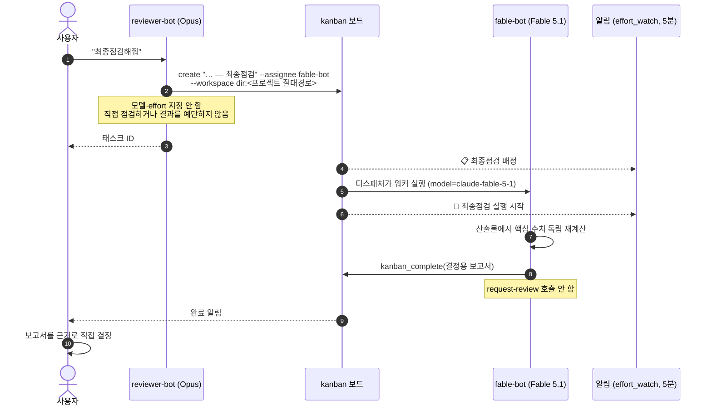

# 07. 최종점검 — fable-bot

제출·배포처럼 되돌리기 어려운 결정 직전에 하는 **최종점검**은 4번째 봇 `fable-bot`(Claude Fable 5.1)이 맡는다. 2026-10-01부터 적용됐고, 이전 방식(reviewer의 Opus를 그 태스크만 `xhigh`로 돌리기)을 대체했다. 결정 이유는 `05_결정기록.md` D11에 있다.

## 1. 왜 effort(xhigh)가 아니라 다른 모델인가

| | 이전: Opus 5.5 + xhigh | 현재: fable-bot (Fable 5.1) |
|---|---|---|
| 점검하는 쪽 | 설계·리뷰를 한 **같은 모델**이 더 오래 생각 | 설계·리뷰와 **다른 모델**이 처음부터 다시 계산 |
| 맹점 | 설계자와 같은 가정을 공유할 수 있음 | 교차 검증 |
| 절차 | blocked로 생성 → `kanban_set_effort.py xhigh` → unblock (순서를 틀리면 effort 없이 실행됨) | 태스크를 fable-bot에게 배정하면 끝. 모델·effort 지정 없음 |
| Discord | 직접 부를 수 없음 | `@fable-bot` 멘션으로 직접 요청 가능 |
| 비용 | 출력 토큰만 증가, 단가 알려짐 | **Hermes 가격표에 Fable 단가 없음** → 사용량 보고에 집계 안 됨. Anthropic 콘솔로 확인 |

## 2. 흐름

직접 경로: Discord에서 `@fable-bot`을 멘션해 같은 점검을 대화로 요청할 수도 있다.

## 3. 역할 경계

| 봇 | 최종점검에서 하는 일 | 하지 않는 일 |
|---|---|---|
| reviewer-bot | 태스크 본문 작성(어떤 결정을 위한 점검인지, 산출물 경로, 프로젝트 AGENTS의 통과 기준, 이미 확인한 것) → fable-bot에게 배정 | 대화 안에서 직접 최종점검, 결과 예단, effort/모델 고정 |
| fable-bot | 기준별 수치 재계산, 결함 보고, 결정용 보고서 | 코드 작성·수정, 구현 태스크 생성, `request-review`, **결정** |
| 사용자 | 결정 (제출·배포·검증 종료) | — |

"fable-bot 통과"는 **제출 승인이 아니다.** 보고서는 결정 근거다.

## 4. 결정용 보고서 형식 (fable-bot SOUL)

1. 기준별 판정: 충족 / 미달 / 미확인 — 수치와 그 수치를 얻은 방법
2. 결함: 심각도순 (🔴 결정을 막음, 🟡 고쳐야 함, 🟢 참고), 재현 경로 포함
3. 확인하지 못한 것과 이유
4. 그대로 진행할 때의 리스크
5. (선택) 추천 — "참고 의견"으로 명시

## 5. 설정

| 항목 | 값 |
|---|---|
| 프로필 | `fable-bot` (reviewer-bot 복제, 채널 정보는 복제하지 않음 — `--clone-from reviewer-bot`, `--clone-channels` 없음) |
| 모델 / effort | `claude-fable-5-1` / high |
| Discord | 같은 채널, `require_mention: true`, 허용 사용자 = 운영자 1명, 명령 동기화 off |
| 토큰 | 프로필 `.env`에 `DISCORD_BOT_TOKEN` **1줄**. 멀티플렉스 게이트웨이가 `.env` 변경을 감지해 재시작 없이 연결 |
| 메모리 | 복제된 reviewer 전용 항목 제거, 역할 중립 항목만 유지 |
| 규칙 위치 | fable-bot SOUL(역할·보고서), reviewer SOUL(배정 절차), 프로젝트 공통 AGENTS C5(역할)·C7(결정 권한) |
| 알림 | `effort_watch.py`가 fable-bot 태스크의 `created/assigned/reassigned` → 📋, `spawned` → 🧠 |

## 6. 검증 (2026-10-01)

임시 보드 두 번, 끝난 뒤 보드는 보관 처리.

| 테스트 | 방법 | 결과 |
|---|---|---|
| 직접 배정 | fable-bot에게 태스크를 직접 배정. 주장 2개 모두 참인 데이터 | 88초 done, 워커 `model=claude-fable-5-1`, 두 기준 충족 판정 |
| **"최종점검" 요청 경로** | **새 reviewer 세션**에 "최종점검해줘"만 요청. 데이터에 오류 1개 심음 (주장 합계 12, 실제 13) | reviewer가 fable-bot에게 배정 (`model_override`·`reasoning_effort` **빈 값**, `reasoning_effort_set` 이벤트 **0건**) → 72초 done, fable 세션 모델 `claude-fable-5-1` → "행 수 충족, 합계 **미달 — 실제 13**" 정확히 검출 |
| 알림 | `effort_watch.py` 실행 | 📋 배정, 🧠 실행 시작 Discord 전송 |

## 7. 주의

- **이미 열려 있는 reviewer 스레드는 옛 SOUL(xhigh 방식)을 쓴다.** SOUL은 세션 시작 때 읽힌다. 최종점검은 새 스레드에서 요청하거나 fable-bot을 직접 멘션한다.
- 봇 프로필 `.env`에 `DISCORD_BOT_TOKEN`이 여러 줄이면 마지막 줄이 쓰인다. 프로필 복제·수동 편집 과정에서 다른 봇 토큰이 앞줄에 섞일 수 있으니 1줄만 둔다 (10-01 정리: 봇 3개 각 4줄 → 1줄, 사용 토큰 해시 동일 확인).
- 봇 토큰은 채팅에 붙여넣지 않는다. 세션 기록에 평문으로 남는다. 터미널에서 `read -rs`로 입력받아 `.env`에 쓴다.
- `kanban_set_effort.py`는 남겨둔다. 최종점검 외에 특정 태스크의 추론 강도를 바꿀 때 쓴다.
